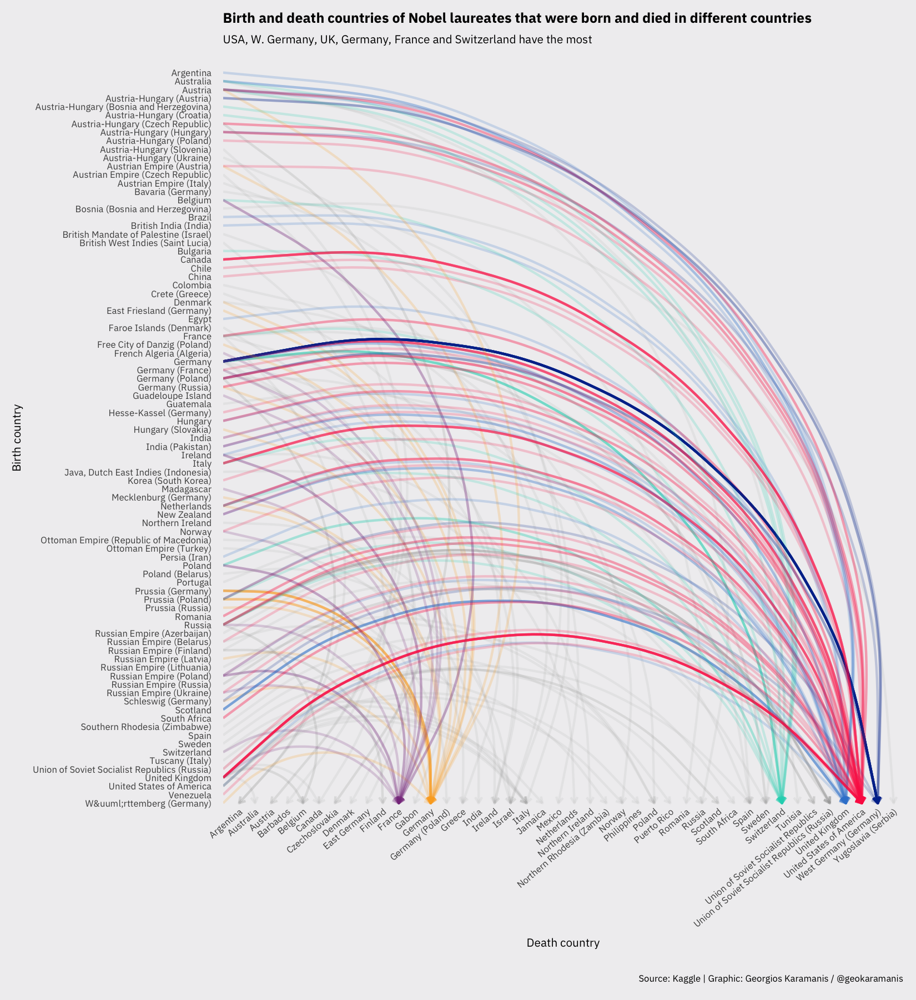
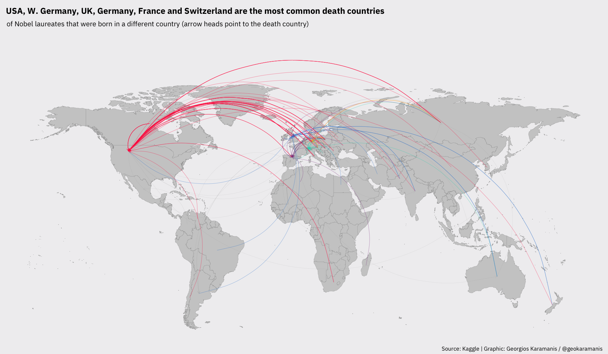
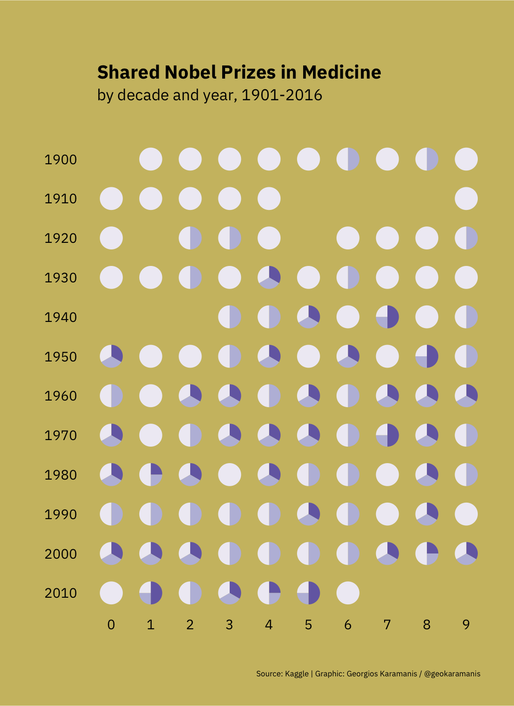
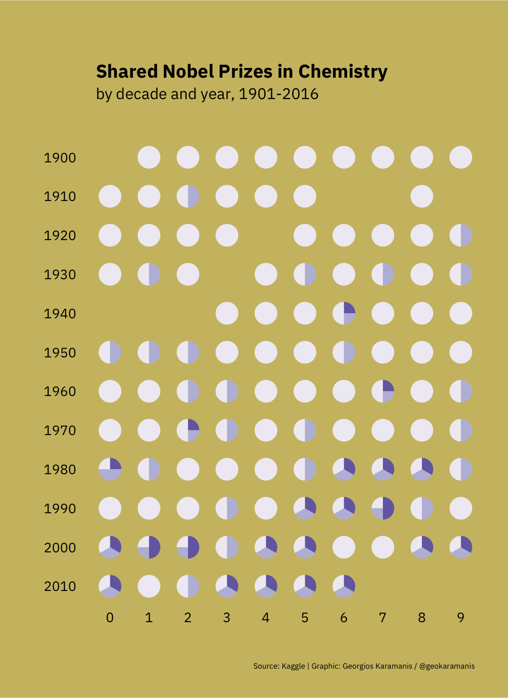
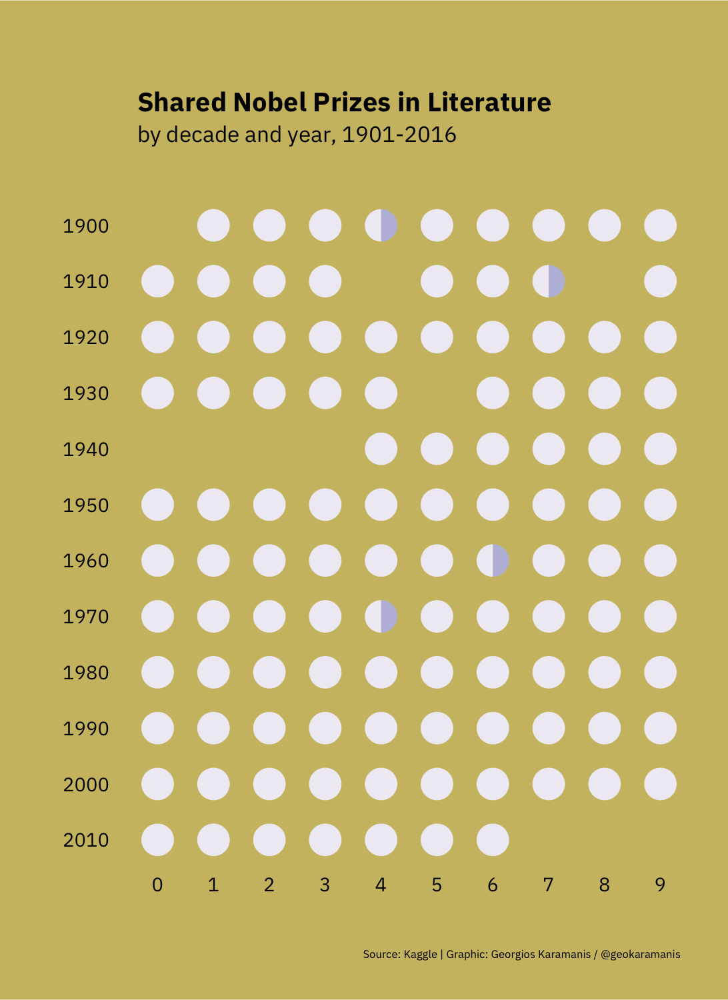
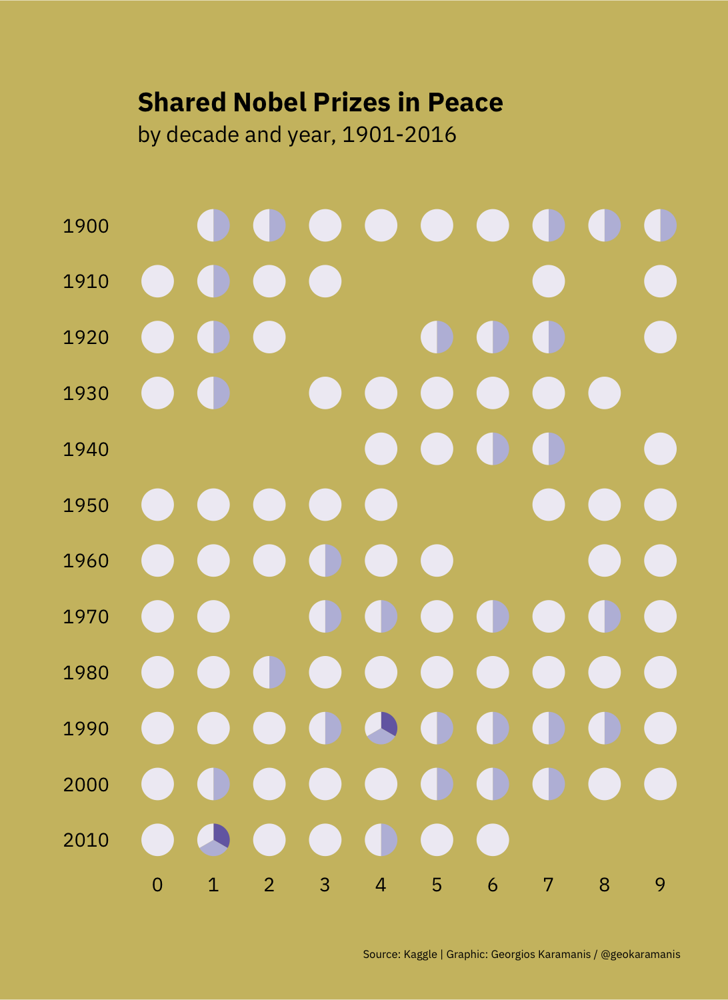
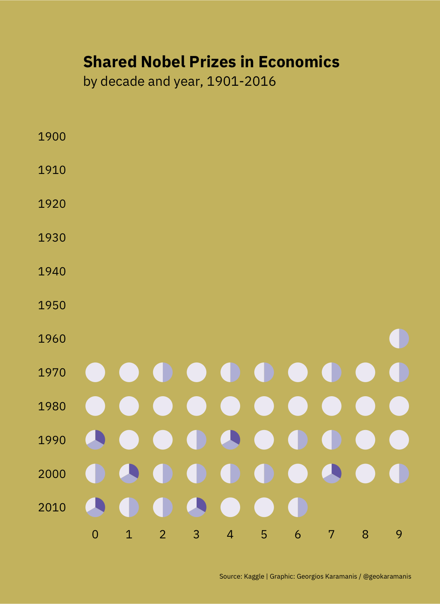

https://github.com/rfordatascience/tidytuesday/tree/master/data/2019/2019-05-14  

The same plot with cleaned country names with code by @RoedSimon90. Not accurate historically but as clean as it can get!

Plot on world map. Countries cleaned and changed to match current countries

Shared prizes by category (poster versions!)

|    |   |   |
| ------------- | ------------- | ------------- |
| |  | 
| |  | 