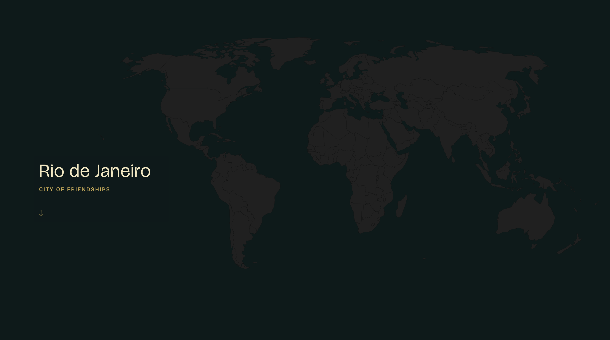
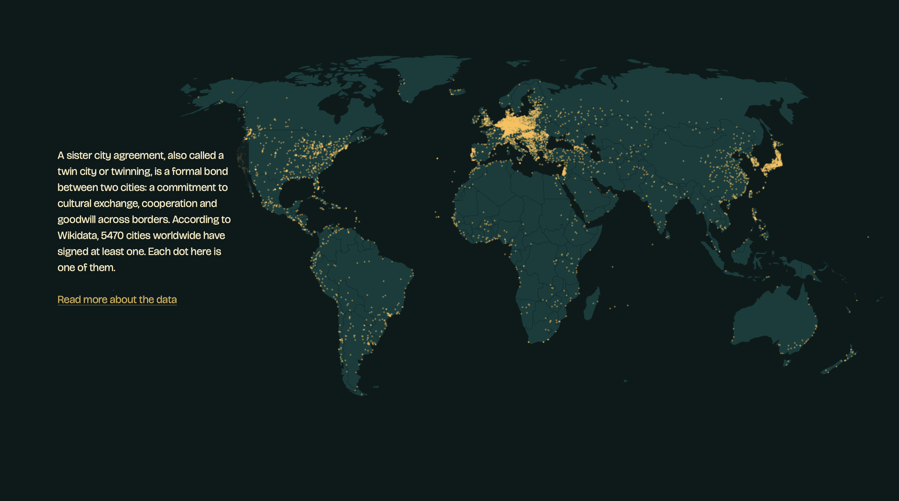
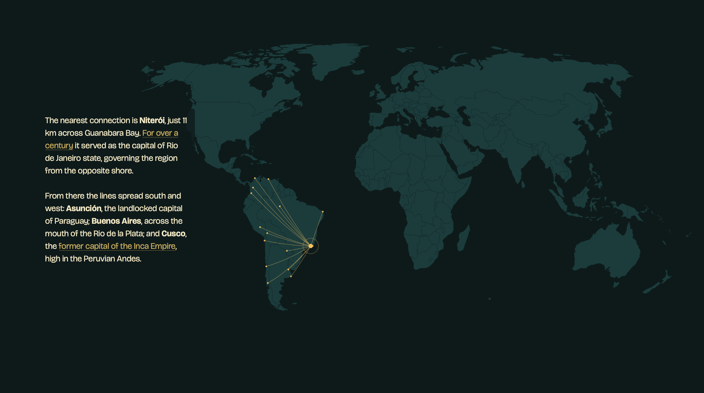
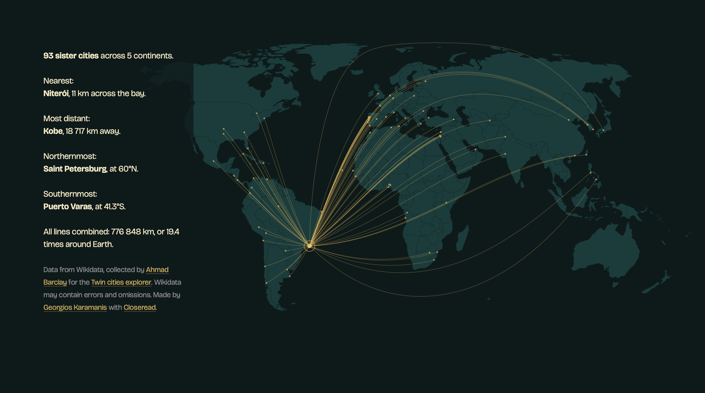

https://github.com/rfordatascience/tidytuesday/tree/master/data/2026/2026-05-12

[See the interactive version on Posit Connect Cloud](https://019e2679-54db-2e9a-2e03-8bbc8b92210f.share.connect.posit.cloud)

<table>
  <tr>
    <td></td>
    <td></td>
  </tr>
  <tr>
    <td></td>
    <td></td>
  </tr>
</table>
