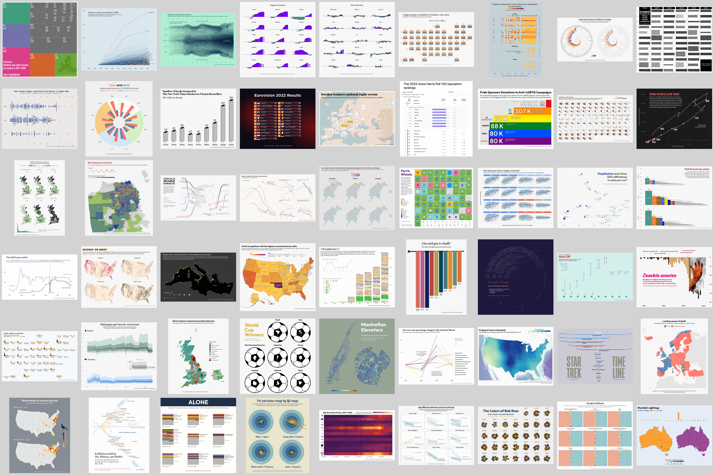
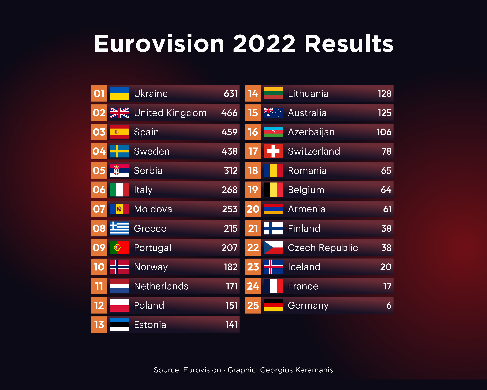
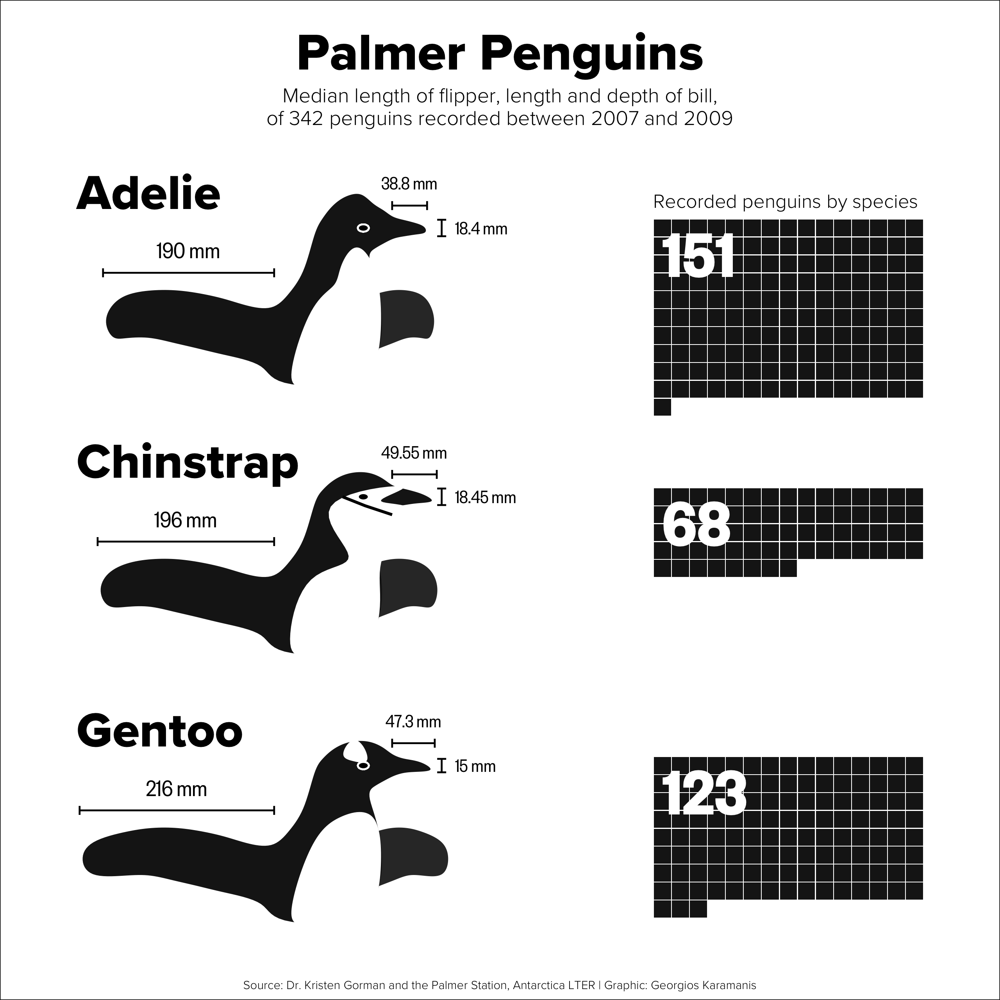
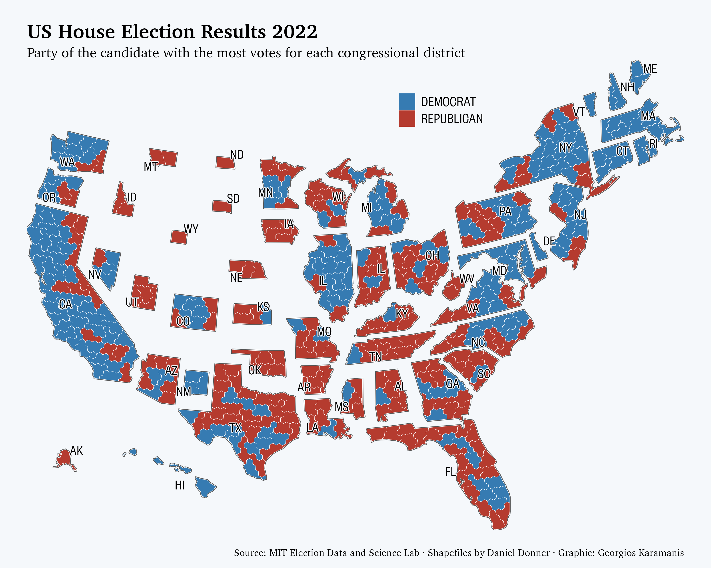
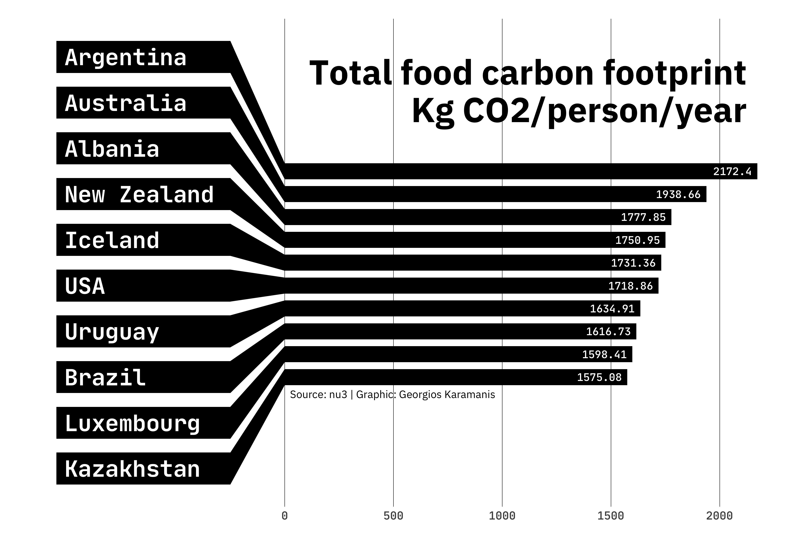
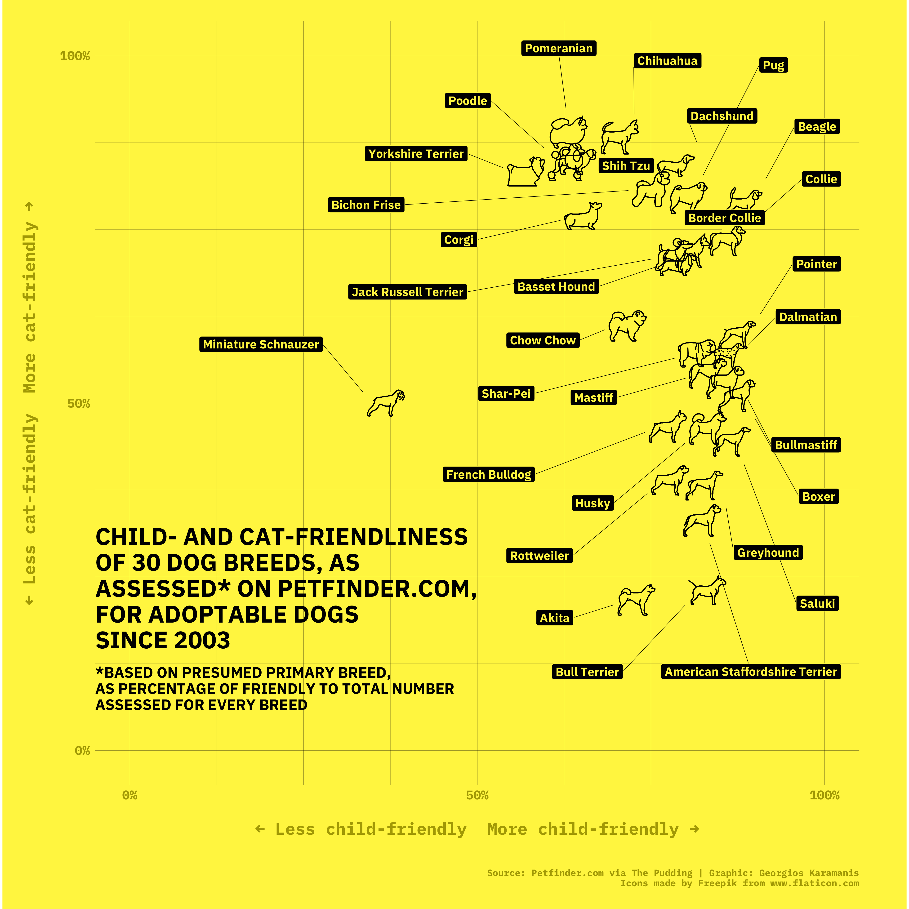
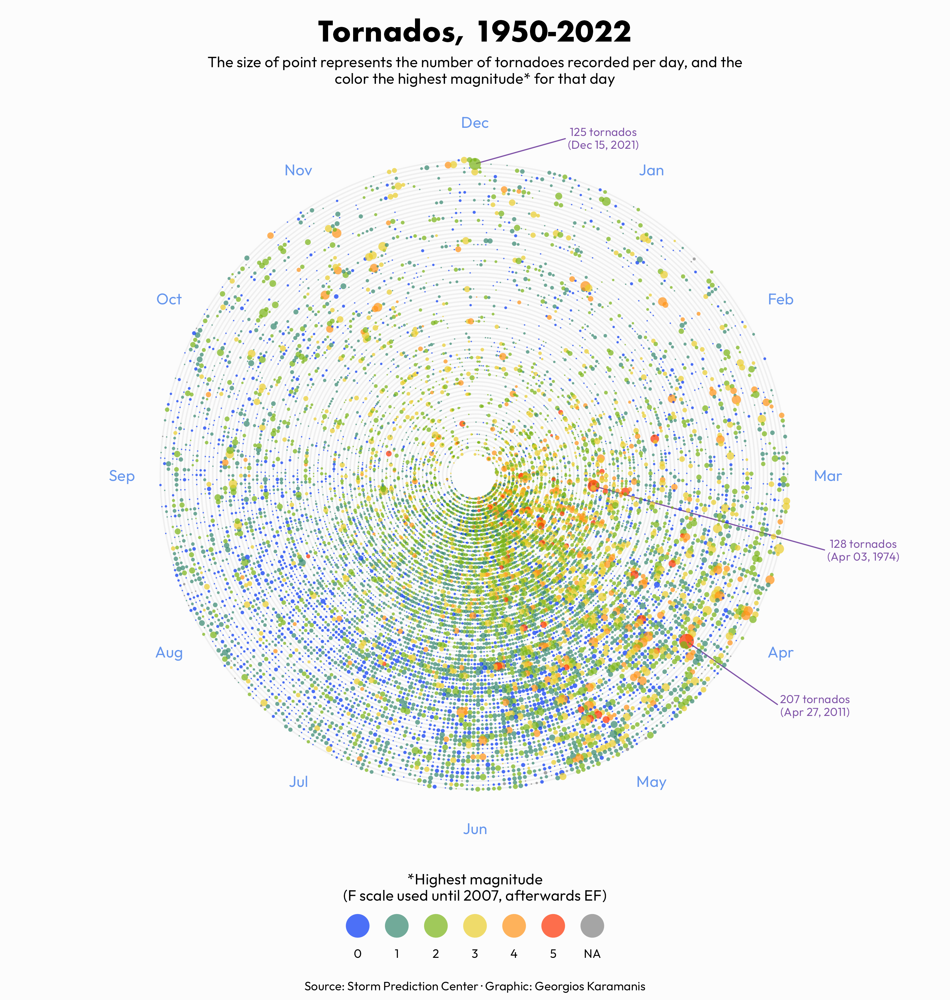
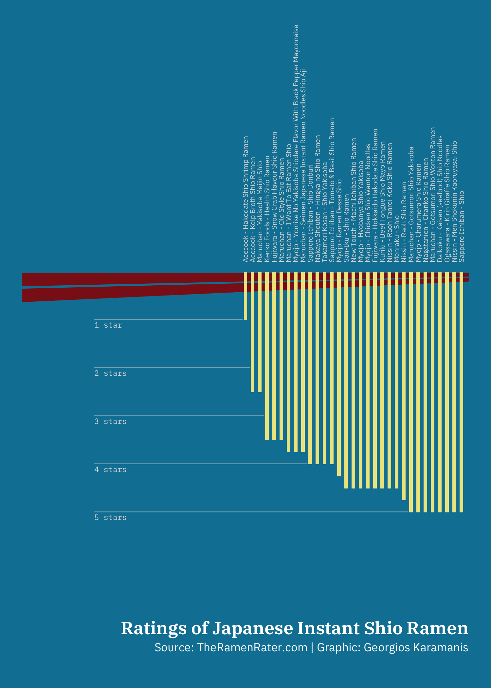

# tidytuesday

Code and plots of the submissions to the [#tidytuesday](https://github.com/rfordatascience/tidytuesday) challenge  

### First year (March 2019 - February 2020)
---
  

### Second year (March 2020 - March 2021)
---
  

### Third year (March 2021 - March 2022)
---
  

### Fourth year (March 2022 - March 2023)
---
  

### Fifth year (March 2023 - March 2024)
---
  

### Highlights (click on image to go to code):  
---

 
  

	
	
	
  	
	
	
  	
	
	
	
	
	
  

