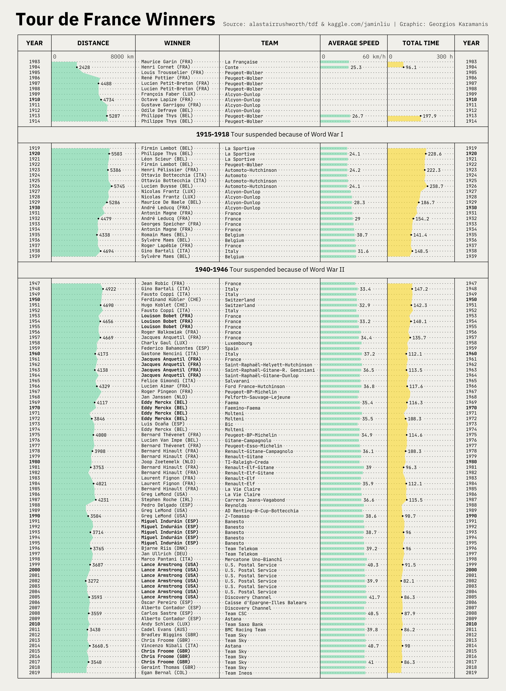

# tidytuesday

Code and plots of the submissions to the [#tidytuesday](https://github.com/rfordatascience/tidytuesday) challenge  

### First year (March 2019 - February 2020)
---
  

### Highlights (click on image to go to code):  
---

 
  

  	
	
  	
  	
  	
	
	
	
	
	
  

