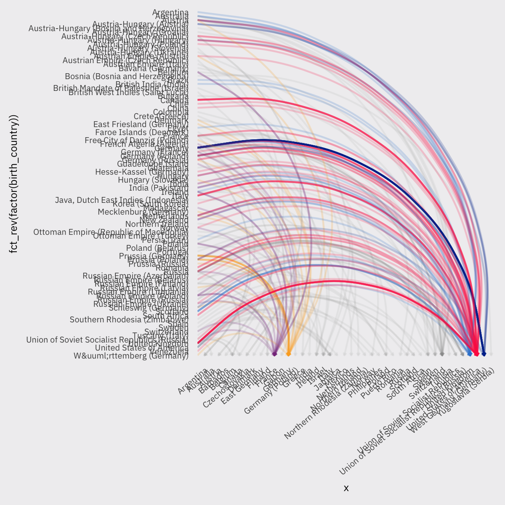

https://github.com/rfordatascience/tidytuesday/tree/master/data/2019/2019-05-14  

The same plot with cleaned country names with code by @RoedSimon90. Not accurate historically but as clean as it can get!
